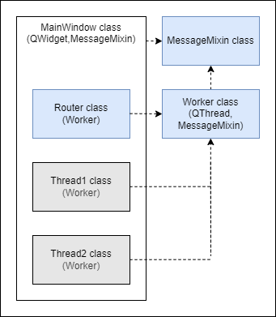

<!--
    README
 -->

# Pyside Thread App Templete

<!-- [](./README.md) -->
<!-- [](./README_JA.md) -->
[](./README.md)
[](./LICENSE)
[](https://mypy-lang.org/)

[](https://github.com/python)
[](https://github.com/astral-sh/uv)
[](https://github.com/astral-sh/ruff)
<!-- [](https://github.com/sphinx-doc/sphinx) -->
<!-- [](https://github.com/pytest-dev/pytest) -->

本リポジトリでは、pysideの`QThread`を用いたGUIアプリのテンプレートを定義しています。

下記のことを意識して実装しています。

* UI処理とロジック処理の分離
* 実装を最小限にスレッドを増やせる
* 循環参照しないようにする

## Getting started

### githubからインストール

```bash
git clone https://github.com/r-dev95/pyside-thread-app-templete.git
```

### 仮想環境の構築

`uv`がインストールされていることが前提です。

pythonの開発環境がまだ整っていない方は、[こちら](https://github.com/r-dev95/env-python)。

```bash
cd pyside-thread-app-templete/
uv sync
```

### 実行

```bash
cd src
python app.py
```

## 画面


|項目                          |ウィジェット|機能                              |
| ---                          | ---        | ---                              |
|スタートボタン                |pushButton  |スレッド処理を開始。              |
|ストップボタン                |pushButton  |スレッド処理を停止。              |
|自動スクロールチェックボックス|checkBox    |ログ領域の自動スクロールのON/OFF。|
|ログ表示領域                  |listWidget  |ログの表示。                      |

画面はスレッドの挙動を確認するために最小限の構成としています。

`pyside6-designer`でuiファイルを作成し、`pyside6-uic`で変換したpythonファイルを使用します。

## 機能



> [!Note]
> 上図グレーのクラスは、処理を確認するためだけの今回限りのクラスです。

上図、青色のクラスの機能について下記に示します。

### MessageMixin

下記、機能を定義するためのメソッドを持つだけのクラスです。

実際の処理は子クラスに実装します。

* `Router`クラスを介して、別スレッドへメッセージを送信する機能 (`send_msg`)
* `Router`クラスを介して、別スレッドからメッセージを受信する機能 (`receive_msg`)

### Worker (QThread, MessageMixin)

* `QThread`を用いたスレッドの基本機能 (ex. `run`)

    `QThread`を用いたスレッド実装方法が分からない方は[こちら](#qthreadを用いたスレッドの実装方法)

### Router (Worker)

* スレッド間のメッセージ通信を行うスレッドの登録機能 (`register_thread`)
* 各スレッド間のメッセージ通信を制御する機能 (`route_msg`)

## 使い方

### スレッドクラスの実装

* `Worker`クラスを継承したクラスを実装
* `thread_id`クラス変数にスレッドIDを定義
* `task`メソッドにスレッドの処理を実装
* `receive_msg`メソッドにメッセージ受信時の処理を実装

### メインスレッドクラスの実装 (MainWindow)

* `send_msg`メソッドにメッセージ送信時の処理を実装
* `receive_msg`メソッドにメッセージ受信時の処理を実装
* `Router`クラスにメインスレッドを含む各スレッドを登録する処理を実装 (`setup`を参照)
* メインスレッドを含む各スレッドの`sig_send`シグナルと`Router`クラスの`route_msg`スロットを接続 (`setup`を参照)
* `Router`及びメインスレッドを除くスレッドを開始(停止)する機能を実装

## 基本知識

### `QThread`を用いたスレッドの実装方法

```python
import sys
from PySide6.QtCore import QThread
from PySide6.QtWidgets import QApplication, QWidget

class Thread(QThread):
    def __init__(self, parent):
        super().__init__(parent=parent)

        self.is_running = True

    def run(selff):
        while self.is_running:
            # スレッドの処理を記述

class MainWindow(QWidget):
    def __init__(self):
        self.thread = Thread(parent=self)

        # スレッドの開始 -> runメソッドが呼ばれる
        self.thread.start()

app = QApplication(sys.argv)
window = MainWindow()
window.show()
sys.exit(app.exec())
```

`QThread`を用いたスレッドは上記のように実装する。

* メインスレッドのクラス内でスレッドクラスをインスタンス化し、インスタンス変数に代入する。
* `.start`でスレッドを開始され、スレッドクラスの`run`メソッドが呼ばれる。

## ライセンス

本リポジトリは、[MIT License](LICENSE)に基づいてライセンスされています。
