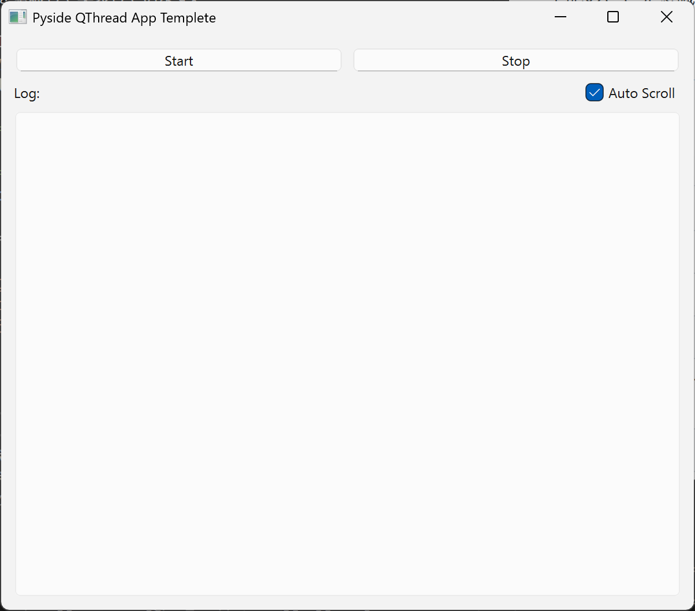
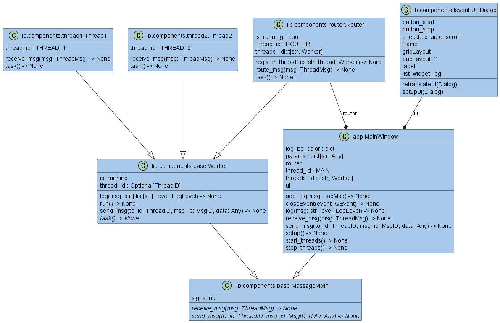

<div align=center>
  
</div>

# :book: Overview

<!-- [](./README.md) -->
<!-- [](./README_JA.md) -->
[](./README.md)
[](./LICENSE)
[](https://mypy-lang.org/)
[](https://github.com/astral-sh/ruff)
[](https://github.com/astral-sh/uv)

[](https://github.com/python)
[](https://github.com/sphinx-doc/sphinx)
[](https://github.com/pytest-dev/pytest)
[](https://github.com/pydantic/pydantic)
[](https://www.qt.io/qt-for-python)

このリポジトリは、PySide6 (Qt for Python) の `QThread` を用いた、堅牢なメッセージパッシングアーキテクチャによるマルチスレッドデスクトップアプリケーションの実装例を提供します。

## :sparkles: Features

<div align=center>
  
</div>

### `QThread`ベースのワーカースレッド

`QThread`を継承した`Worker`クラスを基盤とし、バックグラウンドでの処理を安全に実行します。

### メッセージベースの安全なスレッド間通信

`Router`クラスがハブとなり、各スレッドからのメッセージを適切な宛先にルーティングします。これにより、スレッド間の直接的な依存関係をなくし、安全な通信を実現します。

### 一元化されたロギング

全てのスレッドからのログメッセージをメインスレッドのUIに集約し、リアルタイムで表示します。

## :rocket: Getting Started

### インストールと実行

```bash
# 1. インストール
git clone https://github.com/r-dev95/pyside-thread-demo.git

# 2. 仮想環境の構築
cd pyside-thread-demo
uv sync

# 3. 実行
cd src
uv run python app.py
```

## :bookmark_tabs: アーキテクチャ

<div align=center>
  
</div>

本プロジェクトは、スレッド間の関心を分離し、安全なデータ交換を実現するためにメッセージパッシングアーキテクチャを採用しています。

### 主要コンポーネント

#### `MainWindow` (`app.py`)

アプリケーションのメインクラス。UIのセットアップ、`Router`と`Worker`スレッドのライフサイクル管理（開始/停止）を担当します。

#### `Worker` (`lib/components/base.py`)

全てのワーカースレッドの基底クラス。`QThread`と`MessageMixin`を継承します。

* `task()`: サブクラスで具体的な処理を実装するための抽象メソッド。
* `is_running`: スレッドのループを制御するためのフラグ。
* `log()`: メインウィンドウにログを送信するためのユーティリティメソッド。

#### `MessageMixin` (`lib/components/base.py`)

Qtのシグナル・スロット機構を利用したメッセージ送受信のインターフェースを提供します。

* `sig_send`: `ThreadMsg`オブジェクトを送信するためのシグナル。

#### `Router` (`lib/components/router.py`)

メッセージングの中核を担う特別なワーカースレッド。

* `register_thread()`: 通信を行うスレッドを登録します。
* `route_msg()`: `sig_send`シグナルに接続されたスロット。受信したメッセージを宛先スレッドの`receive_msg()`メソッドに渡します。

### 通信プロトコル

スレッド間の通信は、`lib/common/types.py`で定義されたPydanticモデルによって標準化されています。

#### `ThreadID` (Enum)

各スレッド（`MAIN`, `ROUTER`, `THREAD_1`など）を識別するための一意のID。

#### `MsgID` (Enum)

メッセージの種類（`LOG`, `TEST`など）を定義します。

#### `ThreadMsg` (Pydantic Model)

スレッド間で交換されるメッセージの基本形式。

* `fm_id` (ThreadID): 送信元スレッドID
* `to_id` (ThreadID): 宛先スレッドID
* `msg_id` (MsgID): メッセージID
* `data` (Any): 送信するデータ本体

## :construction_worker: 新しいワーカースレッドの追加方法

### `ThreadID`を追加

`lib/common/types.py`の`ThreadID` Enumに新しいスレッドの一意なIDを追加します。

### `Worker`クラスを継承

`lib/components`内に新しいファイルを作成し、`Worker`クラスを継承したクラスを定義します。

### クラス変数を設定

`thread_id`クラス変数に、ステップ1で定義した`ThreadID`を設定します。

### `task()`を実装

スレッドが実行するメインの処理を`task(self)`メソッド内に実装します。ループ処理中、`self.is_running`フラグを定期的にチェックして、スレッドが安全に停止できるようにしてください。

### `receive_msg()`を実装

他のスレッドからメッセージを受信した際の処理を`receive_msg(self, msg: ThreadMsg)`メソッド内に実装します。

### `MainWindow`に登録

`src/app.py`の`MainWindow.__init__`内で新しいスレッドをインスタンス化し、`self.threads`ディクショナリに追加します。これにより、起動時に自動的に`Router`に登録され、通信が可能になります。

## :key: License

本リポジトリは、[MIT License](LICENSE)に基づいてライセンスされています。
